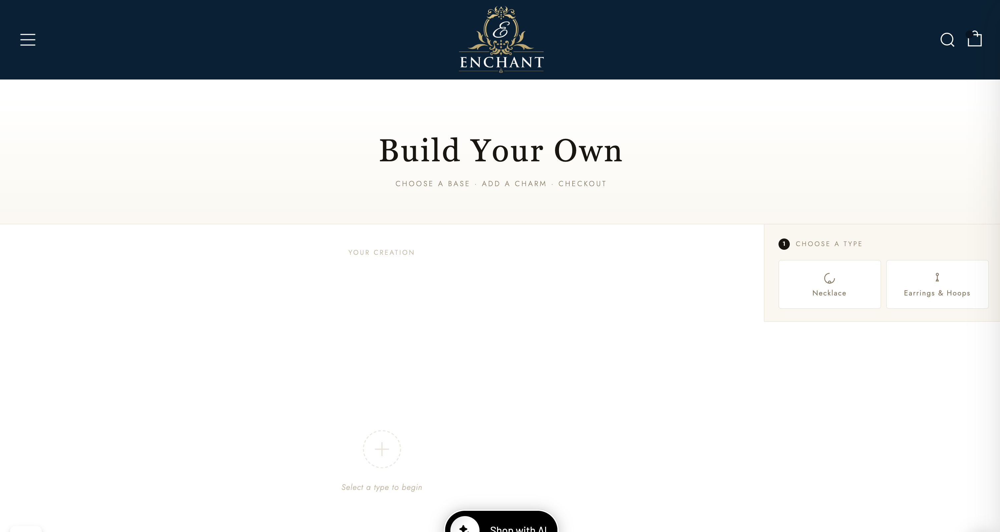
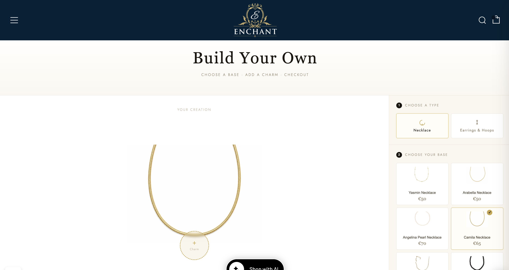
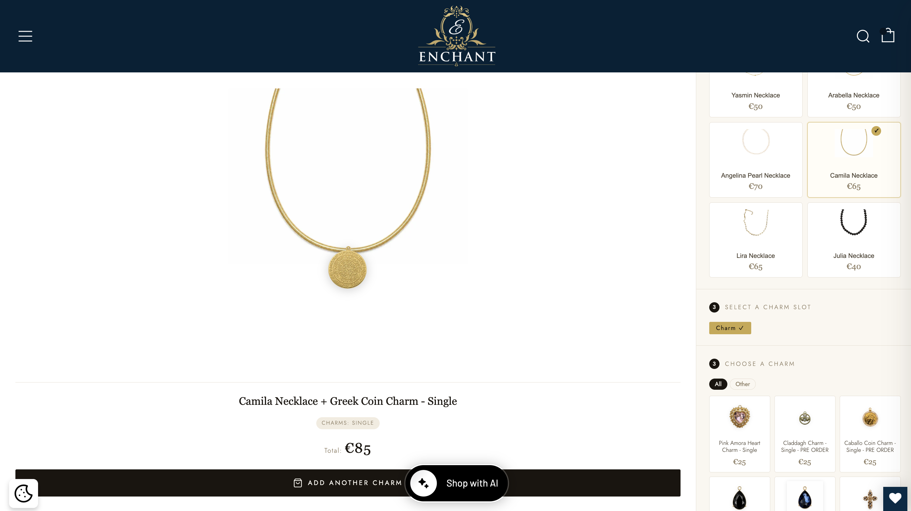
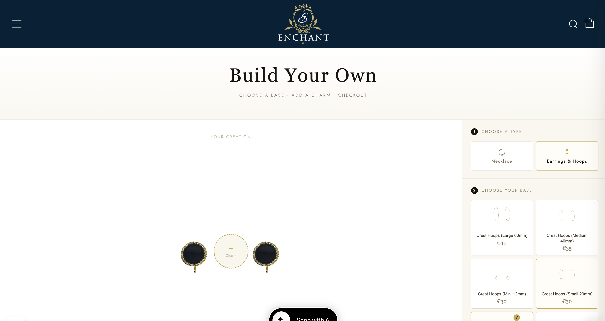
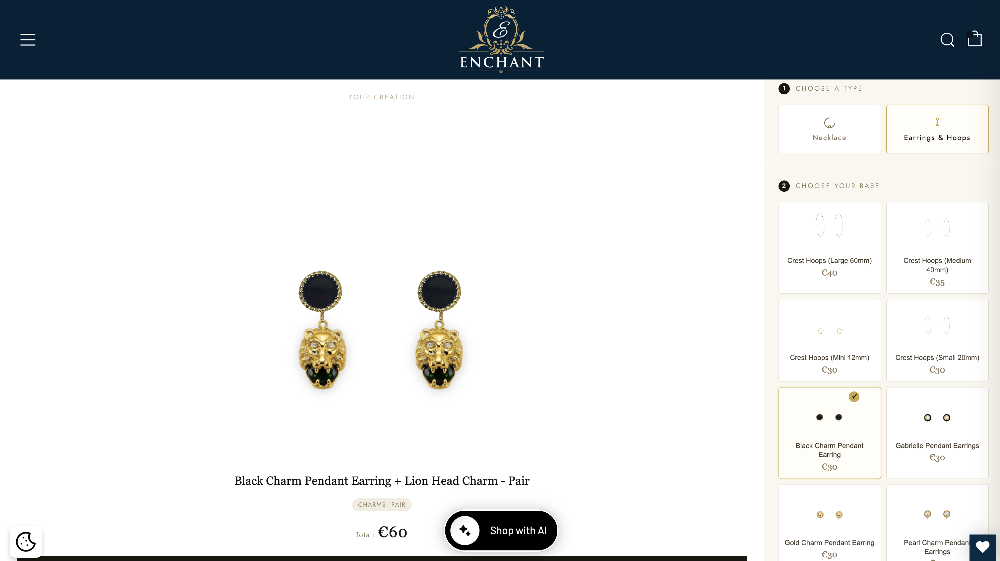
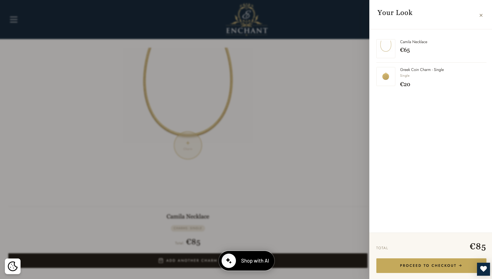
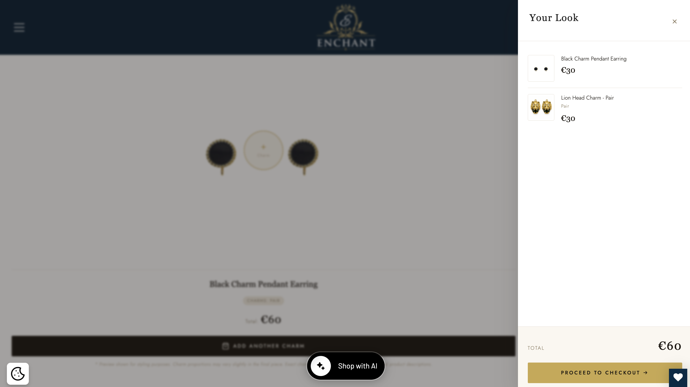

# Shopify Jewelry Configurator

Real-time Shopify jewelry configurator with dynamic variant handling, visual product composition, and custom cart integration.

Custom Shopify configurator developed for Enchant Jewellery (Ireland).

The application allows customers to create personalized jewelry combinations through an interactive visual experience, combining necklaces, earrings, hoops, and charms before checkout.

## Features

* Real-time jewelry visualization
* Necklace configurator
* Earrings and hoops configurator
* Dynamic image overlay system
* Shopify Cart API integration
* Single and Pair variant handling
* Mobile responsive interface
* Shopify metafields integration
* Dynamic product loading from collections
* Live price updates

## Technologies

* Shopify Liquid
* JavaScript (Vanilla JS)
* HTML5
* CSS3
* Shopify AJAX Cart API
* Shopify Metafields

## Preview

### Initial State

### Necklace Configurator

Customer selects a necklace base and a compatible charm.

### Necklace Preview

Single charm rendering for necklaces.

### Earrings & Hoops Configurator

Customer selects earring or hoop bases.

### Earrings Pair Preview

Pair charm rendering logic automatically applied to earrings and hoops.

### Necklace Cart Builder

### Earrings Cart Builder

## Business Logic

### Necklaces

* Uses Single charm variants
* Supports one charm per slot
* Dynamic necklace preview
* Updates pricing in real time
* Stores configuration in Shopify Cart properties

### Earrings & Hoops

* Uses Pair charm variants
* Automatically renders paired charms
* Updates pricing based on pair selection
* Maintains visual synchronization between both earrings
* Supports different hoop and earring base products

### Product Configuration

* Base products loaded dynamically from Shopify collections
* Charm availability controlled by collection logic
* Product positioning controlled through Shopify metafields
* Dynamic slot generation based on product configuration

### Cart Integration

Each custom build is sent to Shopify Cart with:

* Build ID
* Product Role
* Variant Type
* Base Product Reference
* Custom Properties

## Technical Highlights

* Dynamic data loading from Shopify collections
* Custom metafield-driven charm positioning
* Variant management for Single and Pair products
* Interactive cart builder
* Responsive product visualization
* Real-time pricing updates
* Dynamic product filtering
* Custom drawer cart implementation
* Multi-product build system
* Shopify section architecture

## Technical Challenges Solved

* Dynamic charm positioning using metafields
* Single vs Pair variant management
* Real-time image composition
* Custom cart item relationships
* Mobile responsive visualization
* Collection-based product architecture
* Interactive product builder workflow

## Skills Demonstrated

* Front-End Development
* Shopify Development
* JavaScript
* E-commerce Development
* UX/UI Design
* Conversion Rate Optimization (CRO)
* Product Development
* Shopify Architecture
* API Integration
* Responsive Design

## Project

Developed for Enchant Jewellery, an Irish premium jewelry e-commerce brand.

The goal was to create a premium product customization experience that allows customers to visualize personalized jewelry combinations before purchasing, improving engagement and supporting higher-value orders.
